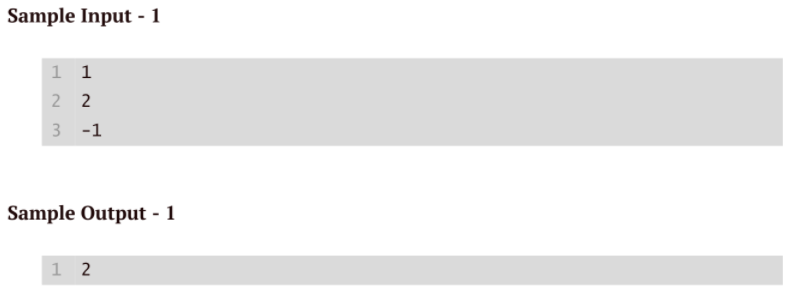

### Write a code to accept the sequence of positive integers in sorted order(either in non ascending order or non descending order) ending with -1 and at least two integers must be before -1 . In Output print the number of distinct elements in the sorted sequence before -1.


```python
numbers = [] #[2,2,3,4,4,4,5]
while True:
    num = int(input("Enter a positive integer (-1 to end): ")) #2234445-1
    if num == -1:
        break
    numbers.append(num)
distinct_numbers = set(numbers) # (2,3,4,5)
print(f"Number of distinct elements: {len(distinct_numbers)}")
``` 
# Sample Input: 2 2 3 4 4 4 5 -1
# Sample Output:
# Number of distinct elements: 4
# Explanation:      


        