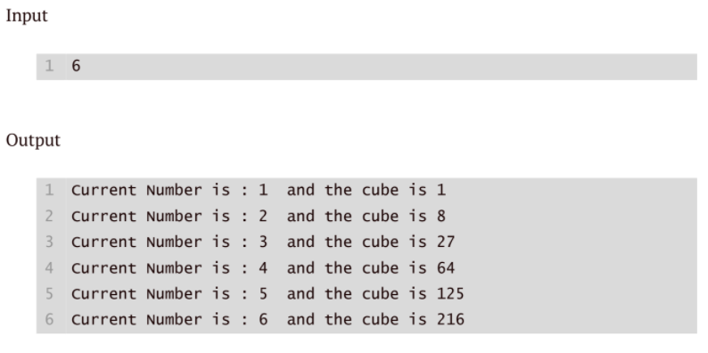

# Accept the positive integer n and display the cube of the number up to a given integer n
# in the following pattern using formatted string.

- 

```python
n = int(input("Enter a positive integer: "))
for i in range(1, n + 1):
    cube = i ** 3
    print(f"{i}^3 = {cube}")
``` 
# Sample Input: 5
# Sample Output:    
# 1^3 = 1
# 2^3 = 8
# 3^3 = 27      
# 4^3 = 64
# 5^3 = 125
# Explanation:
# The program takes a positive integer n as input and iterates from 1 to n.     
# For each integer i in that range, it calculates the cube of i and prints it in the specified format.
```python

n=int(input("Enter the number: "))
for i in range(1,n+1):
cube=i ** 3
print("curent Number is:",i,"and cube of",i,"is:",cube)

```
