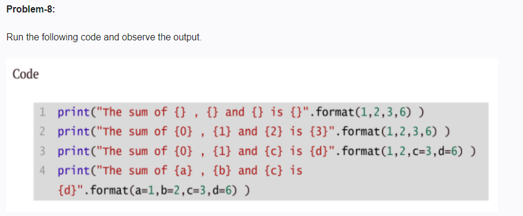

```python
n = int(input("Enter a positive integer: "))

for i in range(1, n + 1):
    factorial = 1
    for j in range(1, i + 1):
        factorial *= j
    print(f"{i}! = {factorial}")
```
# Sample Input: 5
# Sample Output:        
# 1! = 1
# 2! = 2    
# 3! = 6      
# 4! = 24   
# 5! = 120